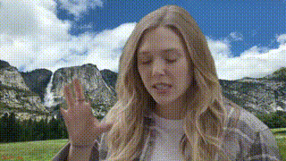

# ncnn-portrait-segmentation
⚡️Real-time portrait segmentation 

This project provides real-time human segmentation based on CPU.

### Requirements
- ncnn
- opencv

### How to build
```
mkdir build
cd build

cmake ..
cmake --build . -j4

cd example
./example_portrait_segmentation [input_video_file.mp4]

```

### Demo


### TODOs
- Add iOS Demo

### Reference
- [ncnn](https://github.com/tencent/ncnn)
- Model was taken from this repo
   - [mobile_phone_human_matting](https://github.com/lizhengwei1992/mobile_phone_human_matting)
   - [Fast_Portrait_Segmentation](https://github.com/lizhengwei1992/Fast_Portrait_Segmentation)